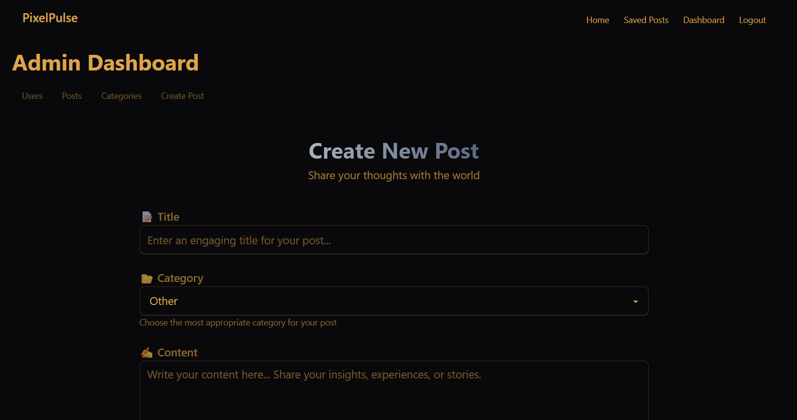
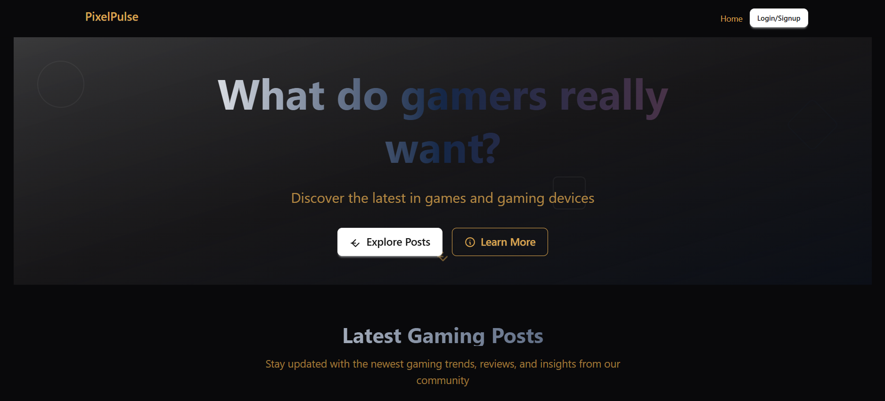
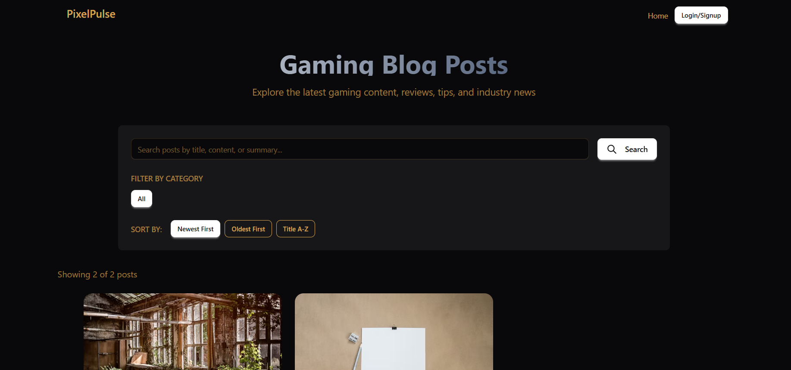

# PixelPulse 🎮

> What do gamers really want? Discover the latest in games and gaming devices


A full-stack MERN (MongoDB, Express.js, React.js, Node.js) gaming blog application that provides the latest gaming news, reviews, and community discussions. Built with modern web technologies and featuring a responsive design.

## 🌟 Features

### 🔐 Authentication & Authorization
- User registration and login
- JWT-based authentication
- Role-based access control (Admin/User)
- Protected routes and middleware

### 📝 Content Management
- Create, read, update, and delete blog posts
- Rich text post content with summaries
- Image upload functionality for post featured images
- Category management system
- Post searching and filtering

### 👥 User Interaction
- Like and comment on posts
- Save posts for later reading
- User profile management
- View count tracking

### 🎨 User Interface
- Responsive design using Tailwind CSS
- Modern UI components with DaisyUI
- Dark/light theme support
- Mobile-first approach

### ⚡ Advanced Features
- Image upload with Multer
- Real-time toast notifications
- Pagination for posts
- Search functionality
- Category filtering

## 🛠️ Tech Stack

### Backend
- **Node.js** - Runtime environment
- **Express.js** - Web framework
- **MongoDB** - Database
- **Mongoose** - ODM for MongoDB
- **JWT** - Authentication
- **bcryptjs** - Password hashing
- **Multer** - File upload handling
- **express-validator** - Input validation

### Frontend
- **React 19** - UI library
- **Vite** - Build tool and development server
- **React Router DOM** - Client-side routing
- **Tailwind CSS** - Utility-first CSS framework
- **DaisyUI** - Component library
- **React Hot Toast** - Notifications

## 📁 Project Structure

```
pixelpulse/
├── backend/                    # Express.js server
│   ├── controllers/           # Route controllers
│   │   ├── authController.js  # Authentication logic
│   │   ├── postController.js  # Post CRUD operations
│   │   ├── userController.js  # User management
│   │   ├── categoryController.js # Category management
│   │   └── uploadController.js # File upload handling
│   ├── middleware/            # Custom middleware
│   │   ├── authMiddleware.js  # JWT verification
│   │   ├── upload.js          # Multer configuration
│   │   └── validation.js      # Input validation
│   ├── models/                # Mongoose schemas
│   │   ├── User.js           # User model
│   │   ├── Post.js           # Post model
│   │   └── Category.js       # Category model
│   ├── routes/                # API routes
│   │   ├── auth.js           # Authentication routes
│   │   ├── posts.js          # Post routes
│   │   ├── users.js          # User routes
│   │   ├── categories.js     # Category routes
│   │   └── upload.js         # Upload routes
│   ├── uploads/               # Uploaded files
│   ├── tests/                 # API tests
│   └── index.js              # Server entry point
├── frontend/                  # React application
│   ├── src/
│   │   ├── components/        # Reusable components
│   │   │   ├── Header.jsx     # Navigation header
│   │   │   ├── Footer.jsx     # Page footer
│   │   │   ├── BlogPost.jsx   # Post display component
│   │   │   ├── ImageUpload.jsx # Image upload component
│   │   │   ├── AdminProtectedRoute.jsx # Admin route protection
│   │   │   ├── UserProtectedRoute.jsx  # User route protection
│   │   │   └── admin/         # Admin components
│   │   │       ├── CategoryList.jsx
│   │   │       ├── CreatePost.jsx
│   │   │       ├── PostList.jsx
│   │   │       └── UserList.jsx
│   │   ├── layouts/           # Layout components
│   │   │   └── MainLayout.jsx
│   │   ├── pages/             # Page components
│   │   │   ├── HomePage.jsx
│   │   │   ├── Blog.jsx
│   │   │   ├── SinglePost.jsx
│   │   │   ├── AuthPage.jsx
│   │   │   ├── LoginPage.jsx
│   │   │   ├── RegisterPage.jsx
│   │   │   ├── DashboardPage.jsx
│   │   │   ├── AdminDashboardPage.jsx
│   │   │   ├── PostEditPage.jsx
│   │   │   ├── UserEditPage.jsx
│   │   │   └── SavedPostsPage.jsx
│   │   ├── assets/            # Static assets
│   │   ├── index.css         # Global styles
│   │   └── main.jsx          # React entry point
│   ├── public/               # Public assets
│   └── index.html            # HTML template
└── docs/                     # Documentation and images
    └── images/               # Image placeholders
```

## 🚀 Getting Started

### Prerequisites

- Node.js (v18 or higher)
- MongoDB (local installation)
- npm or yarn package manager

### Installation

1. **Clone the repository**
   ```bash
   git clone <this repository>
   cd 
   ```

2. **Install backend dependencies**
   ```bash
   cd backend
   npm install
   ```

3. **Install frontend dependencies**
   ```bash
   cd ../frontend
   npm install
   ```

4. **Environment Configuration**
   
   Create a `.env` file in the backend directory:
   ```env
   NODE_ENV=development
   PORT=5000
   MONGODB_URI=mongodb://localhost:27017/pixelpulse
   JWT_SECRET=your_jwt_secret_key_here
   ```

   Create a `.env` file in the frontend directory:
   ```env
   VITE_API_URL=http://localhost:5000/api
   ```

5. **Start the development servers**

   Backend server:
   ```bash
   cd backend
   npm run dev
   ```

   Frontend server (in a new terminal):
   ```bash
   cd frontend
   npm run dev
   ```

6. **Access the application**
   - Frontend: http://localhost:5173
   - Backend API: http://localhost:5000

### 🗄️ Database Setup

1. **MongoDB Local Setup**
   - Install MongoDB locally
   - Start MongoDB service
   - The database will be created automatically

### Creating a Blog Post




### API Testing with Postman
Import the Postman collection from `backend/tests/pixelpulse.postman_collection.json`


## 📸 Screenshots

### Home Page


### Blog Listing


### Single Post View


### User Authentication


## 🤝 Contributing

1. Fork the repository
2. Create a feature branch (`git checkout -b feature/amazing-feature`)
3. Commit your changes (`git commit -m 'Add amazing feature'`)
4. Push to the branch (`git push origin feature/amazing-feature`)
5. Open a Pull Request

## 👨‍💻 Author

**Grace Wambui**
- GitHub: [@WambuiGrace](https://github.com/WambuiGrace)
- Email: wambuigm55@gmail.com

## 🙏 Acknowledgments

- **PLP Academy** for the MERN stack curriculum
- **React Community** for excellent documentation
- **MongoDB** for the powerful database
- **Tailwind CSS** for the utility-first CSS framework
